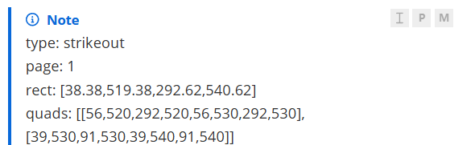

# Callout Copy Button (typora-community-plugin)
[English](README.md) | [简体中文](README.zh.md)

Ported from [alythobani/obsidian-callout-copy-buttons](https://github.com/alythobani/obsidian-callout-copy-buttons), this plugin targets Typora's **native GitHub-style alerts** (the `> [!NOTE]` syntax, rendered as `.md-alert` in Typora ≥ 1.8).
Each alert gets a row of small buttons in its top-right corner, controlled by **three independent toggles** in the settings (matching the toggle model of the original plugin's Reading mode) — if you only want one button, just turn off the other two. By default, only "Select" is enabled.

## Three Behaviors (using this callout as an example)
```markdown
> [!Note]
> type: strikeout
> page: 1
```
| Toggle                                       | Button         | Click Effect                                                 | Output for the Example Above              |
| -------------------------------------------- | -------------- | ------------------------------------------------------------ | ----------------------------------------- |
| Show "Select callout" button (on by default) | 🖱 pointer icon | **Selects the entire callout** (including the `[!Note]` title line); then press Ctrl+C to use Typora's own copy logic, identical to a manual selection | A selection appears in the editor         |
| Show "Copy (plain text)" button              | `P`            | Copies the **body content** as plain text: no title line, no `> ` prefix, no inline markup | `type: strikeout\npage: 1`                |
| Show "Copy (Markdown)" button                | `M`            | Copies the **entire callout** as Markdown source: the `> [!Note]` title line plus all `> ` prefixes intact, so pasting into any Markdown editor still yields a callout | `> [!note]\n> type: strikeout\n> page: 1` |




## Installation

1. Install [typora-community-plugin/typora-community-plugin: Typora plugin system for enhancing your editing experience.](https://github.com/typora-community-plugin/typora-community-plugin)
2. Copy the entire folder to `~/.typora/community-plugins/plugins/callout-copy-button/`
3. Restart Typora → enable "Callout Copy Button" in the plugin center (requires [typora-plugin-core](https://github.com/typora-community-plugin/typora-plugin-core) to be installed)
4. Open any document containing `> [!NOTE]`; hovering over an alert's top-right corner will reveal the buttons
Settings entry: Plugin Center → Callout Copy Button → three toggles. Changes take effect immediately (no restart needed, no need to reopen documents).
## File Structure
```
callout-copy-button/
├── main.js        # All logic (single file, ESM, ~380 lines)
├── manifest.json  # tcp plugin manifest
├── style.css      # Button positioning and P/M letter styling (auto-loaded by core; the filename must not be changed)
```